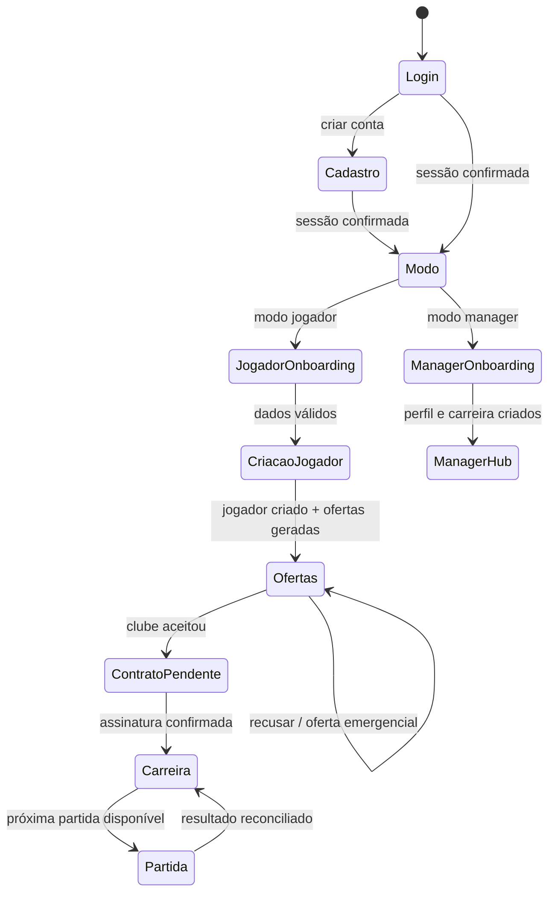

# Auditoria minuciosa do Futbrowser

**Data da auditoria:** 21 de agosto de 2026
**Escopo:** repositório GitHub `oliverlleo/Futbrowser`, prévia local, esquema e dados do projeto Supabase `auth-app` (`aqbikkjvosxvlysbzpvr`).
**Objetivo:** identificar falhas de jogabilidade, continuidade, coerência entre interface e regras de negócio, integridade de dados e riscos de segurança, além de definir uma ordem detalhada e segura de correção.

## 1. Conclusão executiva

O Futbrowser possui uma base de backend significativamente mais avançada que o frontend versionado. O banco vivo já contém onboarding, negociação, carreira, partidas, competições, patrocínios e fundação do modo manager; porém o repositório local contém apenas duas telas HTML e não possui a tela de carreira pós-contrato nem qualquer tela funcional para manager/técnico/presidente. Como resultado, o jogador consegue visualizar uma promessa de carreira e, em alguns cenários, concluir a assinatura, mas não consegue alcançar a experiência principal prometida.

Os problemas mais graves são **bloqueio de continuidade pós-contrato**, **modo manager persistido sem onboarding nem rota**, **estado de negociação aceito que pode permanecer visualmente aberto ou ser sobrescrito como withdrawn**, **recursos da dashboard exibidos com valores fixos**, **ofertas históricas misturadas às ofertas atuais** e **divergência semântica entre clube-base, subelenco U17 e a comunicação “Sub-18”**. Há também uma divergência de engenharia: o Supabase vivo recebeu dezenas de migrações até 14 de agosto, enquanto o Git local possui apenas migrações de julho. Portanto, o repositório não é hoje uma fonte reproduzível do ambiente usado pelos jogadores [1] [2] [3].

A situação não é de banco completamente inconsistente. As invariantes executadas no banco vivo não encontraram duplicidade ativa de jogador por usuário, contrato ativo duplicado, assignment aberto duplicado, carreira concluída sem contrato ou contrato ativo sem estado. Também existem índices únicos para esses casos. O problema principal é a falta de uma **camada canônica de contexto de carreira** e a ausência de um frontend capaz de consumir o backend existente.

> **Recomendação central:** não começar por retoques visuais. Primeiro deve-se congelar a semântica do domínio, sincronizar a história de migrações, corrigir as transições transacionais da negociação e entregar uma rota de carreira mínima. Só depois vale expandir manager, competições, patrocínios e refinamentos de apresentação.

## 2. Método e evidências

A auditoria foi feita em quatro frentes. No repositório, foram revisados os HTMLs, serviços Supabase, validadores, dashboard, interface de ofertas, migrações locais, documentação e referências de rota. Na execução local, a tela de login carregou, a troca para cadastro funcionou, o acesso sem sessão à dashboard redirecionou para login e todos os arquivos JavaScript em `src/` passaram em `node --check` [4] [5]. No Supabase, foram consultadas tabelas, colunas, índices, políticas RLS, migrações, advisories, RPCs críticas e amostras de estado de carreira. A auditoria inicial foi somente leitura; depois da validação, as correções de negociação, onboarding, modo manager e segurança descritas na seção 10 foram aplicadas por migrações versionadas.

A prévia local não tinha uma sessão autenticada disponível para executar criação de jogador, geração de ofertas e assinatura pelo navegador. Por isso, a parte autenticada foi validada cruzando o código local com as definições e os dados do Supabase. As evidências brutas e resumos estão nos artefatos anexos deste relatório [6] [7] [8] [9].

| Dimensão | Resultado | Interpretação |
|---|---:|---|
| Sintaxe dos módulos JavaScript | **PASS** | Não há erro sintático nos 11 arquivos JavaScript de `src/`. |
| Login visual e troca Login/Cadastro | **PASS visual** | A tela inicial e a alternância de telas carregam localmente. |
| Acesso sem sessão à dashboard | **PASS parcial** | Redireciona para login; o fluxo autenticado não foi executado no navegador. |
| Rotas HTML reais no repositório | **2 arquivos** | Existem apenas `index.html` e `dashboard.html`. |
| Usuários com caminho `manager` | **2** | Nenhum possui `manager_profile` ou `manager_career`. |
| Contratos ativos com clube-base diferente do estado esportivo | **4 de 4** | O backend diferencia organização-base de subelenco U17, mas a UI não comunica isso. |
| Jogadores com ofertas iniciais históricas misturadas | **2 casos observados** | Há jogadores com 16 ofertas, sendo 1 accepted e 15 withdrawn. |
| Tabelas públicas sem RLS | **2** | Alerta crítico do Supabase. |
| RPCs SECURITY DEFINER executáveis por `anon` | **13** | Devem ser revogadas ou restritas. |
| RPCs SECURITY DEFINER executáveis por `authenticated` | **53** | Exigem autorização interna rigorosa e revisão de privilégios. |

## 3. Matriz de severidade e ordem de tratamento

| ID | Severidade | Problema | Efeito para o jogador | Prioridade |
|---|---|---|---|---|
| P0-01 | Bloqueador | `career.html` não existe | Depois de assinar, o botão “Iniciar carreira” leva a uma página inexistente. | Corrigir antes de qualquer lançamento jogável. |
| P0-02 | Bloqueador | Caminho manager/técnico/presidente sem tela funcional | Usuário pode persistir ou possuir um caminho que a UI não sabe inicializar. | Corrigir antes de divulgar esses modos. |
| P0-03 | Crítico | Aceite da negociação grava status incorreto | O clube pode aceitar no histórico, mas a oferta continua `countered` ou depois aparece `withdrawn`; a UI oferece ações contraditórias. | Corrigir com migração/RPC e teste transacional. |
| P0-04 | Crítico | Git e Supabase estão fora de sincronia | Correções locais não reproduzem produção; rollback e revisão ficam inseguros. | Congelar mudanças e reconciliar migrações. |
| P1-01 | Alto | Energia, saldo e sala são hardcoded | O jogador vê recursos que não correspondem ao seu estado real. | Trocar por dados de `get_career_hub`/RPC canônica. |
| P1-02 | Alto | Lista de ofertas não filtra status | Ofertas aceitas/retiradas aparecem junto das opções disponíveis. | Filtrar no serviço e separar histórico. |
| P1-03 | Alto | Subelenco U17 é apresentado como Sub-18 | O jogador não sabe em qual competição/categoria realmente entrou. | Exibir `target_squad_level` e o clube esportivo correto. |
| P1-04 | Alto | Altura/peso vazios viram texto `"null"` | O servidor rejeita a criação com mensagem genérica, embora a tela permita deixar os campos vazios. | Validar no cliente e marcar campos obrigatórios. |
| P1-05 | Alto | `reset-password.html` não existe | Recuperação de senha envia o usuário para um destino inexistente. | Criar página de redefinição ou remover promessa da tela. |
| P1-06 | Alto | `usuarios.caminho` não possui CHECK | Cliente autenticado pode gravar valores arbitrários diretamente. | Canonicalizar modo e mover escolha para RPC. |
| P1-07 | Alto | RLS desabilitado em duas tabelas | Dados de competição e recompensas de patrocinador ficam expostos aos papéis públicos. | Criar políticas antes de habilitar RLS. |
| P1-08 | Alto | 13 funções SECURITY DEFINER executáveis por anon | Rotinas internas podem ser chamadas sem autenticação. | Revogar `EXECUTE` de `anon` imediatamente. |
| P2-01 | Médio | Contadores “online” e “novos jogadores” são fixos | O mundo parece simulado e perde coerência com a alegação de tempo real. | Remover ou alimentar por métrica real. |
| P2-02 | Médio | Tempo de jogo e início são fixos | A UI promete “Regular” e “Imediato” sem consultar regras reais. | Derivar do contrato, data e chance de jogo. |
| P2-03 | Médio | Documentação declara paridade Git/produção que não existe | A equipe pode aprovar mudanças com premissas erradas. | Atualizar processo e documento de baseline. |
| P2-04 | Baixo | Fallback `img/clubs/default.png` está ausente | Cada clube sem asset gera uma requisição quebrada antes do fallback textual. | Adicionar asset ou usar `shield_url` do banco. |

## 4. Problemas detalhados e como corrigir

### 4.1. O fluxo principal termina em uma rota inexistente

A assinatura é apresentada em `showFinalSplash()`. O botão final usa `window.location.href = 'career.html'`, mas o repositório contém apenas `index.html` e `dashboard.html` [2] [3]. Isso transforma o aceite do contrato em um beco sem saída: o jogador toma a principal decisão de onboarding, vê a confirmação e perde o acesso à carreira.

A correção deve ser uma entrega vertical mínima, não apenas a criação de um arquivo vazio. Recomenda-se criar `career.html` e `src/pages/career/career.js` com quatro áreas funcionais: resumo do jogador e recursos; calendário/próxima partida; ações diárias; inbox/eventos. O backend vivo já possui tabelas e RPCs para ações, eventos, partidas, desenvolvimento e mensagens; a primeira versão da tela deve consumir uma RPC agregadora, como `get_career_hub()`, em vez de fazer dezenas de consultas independentes [10].

A primeira versão precisa ter estados explícitos de carregamento, erro, sessão expirada, carreira sem contrato e carreira pronta. O botão de iniciar carreira deve aguardar a confirmação de que o estado está carregado, não depender de `onclick` inline e não exibir sucesso antes de o backend retornar.

### 4.2. Os caminhos de técnico/presidente/manager não formam uma jornada

A tela inicial oferece Jogador, Técnico, Presidente e Seleção [4]. A dashboard contém cards para jogador, técnico e presidente [3], mas a implementação de `saveChosenPath()` apenas salva o valor e mostra um toast de “próxima tela futura” para técnico/presidente; não há rota funcional. Além disso, o bloco que calcula `tecnico.html` e `presidente.html` está depois de um `return`, portanto é código inalcançável [1].

O banco vivo já usa `caminho = 'manager'` para dois usuários, mas ambos não têm `manager_profile` nem `manager_career`. Isso significa que o valor persistido e os valores aceitos pela UI não são canônicos. A solução recomendada é armazenar `caminho = 'manager'` como modo de gestão e guardar `profile_type = 'tecnico'` ou `profile_type = 'presidente'` em `manager_profiles`. Se “Seleção” for um modo real, ele deve ganhar um valor canônico e uma sequência de onboarding própria; caso contrário, deve ser retirado da promessa pública.

A escolha de modo deve ser feita por uma RPC autorizada, por exemplo `set_career_mode(p_mode text, p_profile_type text)`, que valide a combinação, crie o perfil necessário e seja idempotente. A interface não deve atualizar diretamente `usuarios.caminho` com um `UPDATE` aberto ao cliente. O banco atualmente não possui CHECK constraint para `caminho`, embora a política de UPDATE permita ao próprio usuário alterar a linha [11].

### 4.3. A negociação possui uma transição de estado incorreta

A regra viva de negociação reconhece três ações: `accepted`, `countered` e `withdrawn`. Contudo, no ramo de atualização da função, o caso `accepted` não possui uma atualização própria; o `ELSE` grava `status = 'countered'`. A mesma estrutura aparece na migração local de negociação [7]. O resultado é incoerente: o histórico pode informar que o clube aceitou, enquanto o cartão ainda mostra “Em negociação” e oferece “Negociar termos” outra vez.

O problema já deixou evidência no banco: existe histórico com `response_action = 'accepted'` para uma oferta cujo status atual não é `accepted`. Em um caso observado, o status terminou como `withdrawn`, porque o aceite de uma proposta foi seguido pela retirada das demais ofertas. A regra de retirada precisa excluir qualquer oferta aceita e a transição precisa ser atômica.

A correção mínima da RPC é separar os três ramos:

```sql
IF v_response_action = 'accepted' THEN
  UPDATE public.player_offers
     SET status = 'accepted',
         current_terms = v_response_terms,
         round = v_round,
         internal_tolerance = v_flex_rem
   WHERE id = p_offer_id;
ELSIF v_response_action = 'withdrawn' THEN
  UPDATE public.player_offers
     SET status = 'withdrawn',
         round = v_round,
         internal_tolerance = v_flex_rem
   WHERE id = p_offer_id;
ELSE
  UPDATE public.player_offers
     SET status = 'countered',
         current_terms = v_response_terms,
         round = v_round,
         internal_tolerance = v_flex_rem
   WHERE id = p_offer_id;
END IF;
```

Antes de retirar as outras ofertas, a função de aceite deve executar `UPDATE ... SET status = 'withdrawn' ... AND status IN (...)` somente para ofertas diferentes da oferta aceita. Também deve haver um teste que simule duas aceitações concorrentes. O banco possui índice único parcial para um contrato ativo por jogador, o que protege contra dois contratos ativos, mas a experiência ainda pode produzir mensagens contraditórias se a primeira oferta aceita for marcada como retirada [12].

Depois da correção, o frontend deve tratar `accepted` como estado não negociável: mostrar apenas “Assinar contrato”, esconder “Negociar termos” e impedir recusa. O aceite da contraproposta deve deixar a oferta em `countered` apenas quando o clube fez uma nova contraproposta, não quando aceitou.

### 4.4. Ofertas encerradas estão misturadas às ofertas atuais

`getActiveOffers()` consulta `player_offers` e ordena por data, mas não filtra `status` nem `offer_type` [6]. A UI até conhece os estados `accepted`, `rejected`, `withdrawn` e `expired`, mas continua renderizando os cartões encerrados na mesma lista. Há jogadores com 16 ofertas iniciais no banco: uma accepted e quinze withdrawn, enquanto jogadores novos possuem cinco ofertas `new` [13].

A correção imediata é filtrar no serviço:

```js
.in('status', ['new', 'reviewed', 'negotiating', 'countered'])
.eq('offer_type', 'initial')
```

O histórico deve ser uma seção separada, carregada sob demanda. `offersCount` deve contar apenas propostas acionáveis. Ao recarregar a página, a seleção automática deve ignorar estados fechados. O backend também deve manter uma trava de idempotência para garantir no máximo cinco ofertas iniciais abertas por jogador, sem apagar o histórico legítimo.

### 4.5. Clube-base, subelenco U17 e texto “Sub-18” não estão alinhados

A RPC de geração cria ofertas para um clube-base com `club_level = academy` e `squad_level = base`, mas grava `target_squad_level = u17`. Ao aceitar, `accept_offer()` grava o `player_contracts.club_id` como organização-base e `player_career_state.club_id`/`player_squad_assignments.club_id` como equipe esportiva U17. A consulta dos quatro contratos ativos confirmou esse padrão: Goiás Formação → Goiás Formação Sub-17, Belmiro Formação → Belmiro Formação Sub-17 e União Litorânea → União Litorânea Sub-17 [14].

Isso pode ser uma modelagem válida, mas não é coerente com a UI, que chama tudo de “Sub-18”, usa o clube-base para o dossiê e exibe o elenco como “equipe Sub-18” [2]. A solução correta é explicitar o domínio no contrato de dados. Uma resposta de RPC deve separar `organization_club`, `sporting_squad`, `target_squad_level`, `career_stage`, `starts_on` e `next_match_date`. O frontend deve usar o clube-base para projeto/academia e o subelenco para treinador, elenco, calendário e competição.

Não se deve simplesmente trocar todos os IDs em produção sem uma migração de domínio: isso poderia quebrar referências históricas. É mais seguro criar uma RPC/view canônica de contexto e, em uma segunda etapa, adicionar nomes explícitos como `base_club_id` e `sporting_squad_id` nas entidades novas. O texto da UI deve ser gerado a partir de `target_squad_level`, por exemplo “Sub-17”, “Sub-18” ou “Profissional”, e não a partir de uma string fixa.

### 4.6. Recursos da dashboard são falsos para o jogador autenticado

A dashboard mostra `Energia: 82%`, `Dinheiro: R$ 12.500` e `Sala atual: Básica` diretamente no HTML [3]. Os estados vivos consultados possuem energia 95, 81, 100 e 46, e saldo 1.000, 1.900, 3.000 e 9.009 [15]. Portanto, o jogador pode assinar um contrato e continuar vendo um saldo que não corresponde a `player_career_state.cash_balance`.

A correção é remover os valores do HTML e renderizar um estado inicial de carregamento. Depois de obter a resposta agregada do hub, preencher energia, saldo, sala/nível e próxima partida. Se a sala ainda não for uma regra implementada, remover o cartão em vez de exibir um valor fictício. Os contadores “Online agora”, “+1.248 hoje” e “Temporada aberta” também devem ser carregados por métrica real ou removidos; a interface não deve alegar tempo real com números estáticos.

### 4.7. Campos opcionais na tela são obrigatórios no servidor

A RPC viva `create_player()` exige nome, nacionalidade, altura entre 1,10 m e 2,30 m, peso entre 35 kg e 160 kg, posição, arquétipo, pé dominante e avatar válidos. A tela não marca altura e peso como obrigatórios e deixa a criação avançar sem esses campos [1] [3]. Os validadores retornam `null` para entradas vazias; o código transforma esses valores em `String(null)`, produzindo o payload textual `"null"`, que o servidor rejeita [5].

A correção no cliente deve ser feita antes de qualquer toast de “Criando jogador”:

```js
const altura = parseHeightMeters(alturaBruta);
const peso = parseWeightKg(pesoBruto);

if (altura === null) {
  showToast('Dados incompletos', 'Informe uma altura entre 1,10 m e 2,30 m.', 'error');
  return;
}
if (peso === null) {
  showToast('Dados incompletos', 'Informe um peso entre 35 kg e 160 kg.', 'error');
  return;
}
if (!playerData.naturalidade) {
  showToast('Dados incompletos', 'Selecione a nacionalidade.', 'error');
  return;
}
```

O payload deve enviar os números formatados, nunca `String(null)`. No HTML, usar `required`, `min`, `max`, `pattern` e mensagens acessíveis. O servidor continua sendo a autoridade final; a validação do cliente existe para impedir uma experiência de erro evitável.

### 4.8. Recuperação de senha aponta para uma página inexistente

`resetPassword()` usa `window.location.origin + '/reset-password.html'`, mas o arquivo não está no repositório [8]. O usuário recebe a promessa de recuperação, abre o link e pode chegar a um 404. A solução é criar a página com os campos de nova senha e confirmação, inicializar `supabase.auth.updateUser({ password })`, tratar expiração do token e redirecionar para login. Até isso ser implementado, a tela deve informar honestamente que a recuperação está em desenvolvimento.

### 4.9. Segurança do Supabase precisa ser corrigida antes da expansão

O inventário e os advisories do Supabase identificaram duas tabelas públicas sem RLS: `public.competition_definitions` e `public.player_sponsor_performance_rewards`. O serviço recomenda habilitar RLS, mas alerta corretamente que fazê-lo sem políticas bloqueará todos os acessos. O diagnóstico também encontrou 13 funções SECURITY DEFINER executáveis por `anon`, 53 executáveis por `authenticated` e a recomendação de habilitar proteção contra senhas vazadas [16] [17].

A correção não deve ser “habilitar RLS cegamente”. O desenho sugerido é:

```sql
ALTER TABLE public.competition_definitions ENABLE ROW LEVEL SECURITY;
ALTER TABLE public.player_sponsor_performance_rewards ENABLE ROW LEVEL SECURITY;

CREATE POLICY competition_definitions_read_authenticated
  ON public.competition_definitions
  FOR SELECT TO authenticated
  USING (is_active = true);

CREATE POLICY sponsor_rewards_read_owner
  ON public.player_sponsor_performance_rewards
  FOR SELECT TO authenticated
  USING (is_player_owner(player_id));

REVOKE INSERT, UPDATE, DELETE
  ON public.competition_definitions,
     public.player_sponsor_performance_rewards
  FROM anon, authenticated;
```

As políticas devem ser ajustadas ao consumo real do hub. A tabela de definições pode ser lida por authenticated, enquanto recompensas de patrocinador devem permanecer limitadas ao proprietário ou serem entregues somente por RPC. Não aplicar esse SQL sem revisar o fluxo de leitura.

Para as funções anônimas, revisar e revogar `EXECUTE` de `anon`, especialmente rotinas de expiração, revisão de mercado, ofertas e patrocinadores. Uma rotina de manutenção deve ser chamada por job/serviço autorizado, não exposta no PostgREST. Para as funções destinadas ao usuário autenticado, manter `GRANT EXECUTE` apenas para `authenticated`, mas revisar cada função SECURITY DEFINER para validar `auth.uid()`, fixar `search_path` e limitar IDs ao proprietário. As URLs oficiais de remediação estão nas referências [18] [19] [20].

### 4.10. Git e Supabase não são reproduzíveis entre si

O documento interno afirma que os arquivos locais refletem exatamente produção, mas a lista real do Supabase contém migrações até `20260814192140`, incluindo várias rodadas de mercado, competições, partidas, patrocínios e manager. O clone do Git contém apenas 12 migrações locais de julho [8] [10]. O relatório de testes da etapa 2 também declara implementação integral com base em migrações antigas, mas a função viva já evoluiu e possui comportamento diferente em detalhes da negociação [9].

A correção é processual e técnica. Primeiro, congelar novas migrações manuais em produção. Depois, exportar a história oficial de migrações, comparar nomes e versões com o diretório local, identificar mudanças aplicadas fora do Git e decidir entre importar todas as migrações faltantes ou criar uma baseline documentada e verificável. Em seguida, gerar um ambiente de staging a partir dessa baseline e rodar os testes de onboarding, negociação e carreira. Só depois disso uma nova migração deve ser aplicada em produção.

A equipe deve abandonar a afirmação “Git reflete exatamente produção” até existir uma verificação automática de hash/versão. O CI deve falhar quando uma RPC chamada pelo frontend não estiver presente na migração versionada correspondente.

## 5. Fluxo de jogo recomendado após a correção



Cada transição deve possuir uma única autoridade. A UI exibe intenção e estado; RPCs autorizadas alteram o domínio; consultas agregadoras devolvem o contexto para renderização. Não deve haver `UPDATE` direto de campos de progresso críticos a partir do navegador.

## 6. Plano de implementação por fases

| Fase | Entregas | Critério de aceite |
|---|---|---|
| 0 — Reconciliação | Baseline real do Supabase, inventário de migrações, backup e staging | Git e staging reproduzem tabelas, RPCs, políticas e índices relevantes. |
| 1 — P0 | Corrigir `negotiate_offer`, impedir retirada de oferta aceita, corrigir filtros de ofertas e criar rota de carreira mínima | Jogador cria personagem, recebe cinco ofertas, negocia, assina e chega ao hub sem 404. |
| 2 — Coerência | Contexto canônico base-club/sporting-squad; textos dinâmicos U17/U18; recursos reais; próxima partida | Nenhum valor de energia, saldo, categoria, chance ou data é hardcoded. |
| 3 — Modos | RPC e tela de manager; decidir técnico/presidente como `profile_type`; retirar ou implementar Seleção | Cada caminho anunciado tem onboarding, estado persistente e rota funcional. |
| 4 — Segurança | RLS das duas tabelas; revogações de anon; revisão das SECURITY DEFINER; proteção de senha | Advisors sem erros críticos; testes anon/authenticated passam pelo PostgREST. |
| 5 — Qualidade | Redefinição de senha, acessibilidade, assets, observabilidade e testes E2E | Login, recuperação, onboarding, negociação, contrato e hub têm testes automatizados. |

## 7. Plano de testes detalhado

### Testes de contrato e dados

| Teste | Preparação | Resultado esperado |
|---|---|---|
| Criação vazia | Nome válido, altura/peso vazios | Cliente bloqueia antes da RPC; nenhum jogador é criado. |
| Criação válida | Altura 1,78, peso 72, nacionalidade, avatar válido | Uma linha de jogador, atributos calculados pelo servidor, sem escrita direta de atributos. |
| Criação duplicada | Repetir criação para o mesmo usuário | RPC rejeita e índice único permanece íntegro. |
| Cinco ofertas | Jogador sem contrato, geração repetida | Exatamente cinco ofertas iniciais abertas, sem duplicação. |
| Filtro de histórico | Jogador com 1 accepted e 15 withdrawn | UI mostra somente a oferta acionável; histórico fica separado. |
| Aceite direto | Oferta com custo zero | Histórico e `player_offers.status` ficam `accepted`; botão de negociação desaparece. |
| Contraproposta | Exigência dentro da tolerância | Status `countered`, termos atuais retornados e flexibilidade reduzida. |
| Recusa da última | Recusar a última oferta aberta | Uma emergência é criada; ela não pode ser recusada se a regra for “última oportunidade”. |
| Duplo aceite | Duas chamadas concorrentes | Um contrato ativo; a segunda operação falha de forma controlada e a UI recarrega o estado. |
| Contexto de clube | Aceitar oferta para idade 16 | Dossiê identifica organização-base, subelenco U17, treinador e próxima partida sem ambiguidade. |

### Testes de interface e jornada

O teste E2E deve iniciar com uma conta de staging, percorrer cadastro, seleção de modo, criação de jogador, leitura de atributos, geração de cinco ofertas, abertura de dossiê, negociação, recusa, aceite, assinatura e carregamento do hub. Deve repetir o fluxo após refresh em cada etapa. Também deve testar sessão expirada, rede offline, RPC com erro, botão clicado duas vezes, modal fechado no meio da operação e retorno do navegador.

A jornada manager deve ser testada separadamente: selecionar Técnico e Presidente, verificar a decisão de domínio sobre `profile_type`, criar `manager_profile`, criar `manager_career`, carregar elenco e salvar tática. Se o modo Seleção não estiver implementado, ele deve ser removido da tela pública até existir um fluxo equivalente.

## 8. Correções que não devem ser feitas de forma ingênua

Não habilitar RLS sem políticas, não apagar as 15 ofertas withdrawn apenas para fazer a contagem parecer cinco, não trocar todos os `club_id` históricos sem distinguir clube-base de subelenco e não aplicar uma migração copiada do frontend local sobre o Supabase vivo. Também não se deve corrigir apenas o texto “Sub-18” para “Sub-17” sem revisar calendário, competição e regras de idade; o texto precisa vir do mesmo contexto canônico usado pelo backend.

Não tratar a existência de índices únicos como prova de que o fluxo visual está correto. Eles protegem invariantes estruturais, mas não corrigem mensagens contraditórias, rotas inexistentes, estados de negociação mal representados ou recursos fictícios. Da mesma forma, a passagem de `node --check` demonstra apenas sintaxe, não uma jornada de jogo funcional [5].

## 9. Resultado final da auditoria

O Futbrowser está em condição de **protótipo funcional de onboarding parcial**, não de experiência completa de carreira. O caminho de jogador tem uma base de backend aproveitável e boas proteções estruturais, mas termina antes do jogo principal. Os modos manager/técnico/presidente são promessa sem jornada navegável. A maior correção de produto é conectar o backend existente a um hub de carreira real; a maior correção de integridade é tornar as transições de oferta e contrato semanticamente exatas; a maior correção de engenharia é reconciliar produção e Git.

Nenhuma mudança destrutiva foi aplicada nesta auditoria. O próximo passo seguro é executar a Fase 0, escolher a nomenclatura canônica de modos e clubes e, em seguida, implementar os itens P0-01 a P0-04 em uma branch de staging.

## Referências

[1]: ./src/pages/dashboard/dashboard.js "Fluxo de seleção de caminho e criação de jogador"
[2]: ./src/pages/dashboard/offers-ui.js "Interface de ofertas, negociação, aceite e tela final"
[3]: ./dashboard.html "Markup da dashboard e dos cartões de recursos"
[4]: ./index.html "Tela inicial, promessas de caminhos e recuperação de senha"
[5]: ./src/utils/validators.js "Validadores de altura e peso"
[6]: ./src/services/offer-service.js "Serviço de ofertas e carregamento de dados"
[7]: ./supabase/migrations/20260718000010_dynamic_negotiation.sql "Migração local da negociação dinâmica"
[8]: ./docs/RELATORIO_ORGANIZACAO_E_SEGURANCA.md "Relatório interno de organização e segurança"
[9]: ./docs/career-step2-backend-test-report.md "Relatório interno de testes da etapa 2"
[10]: ./audit_artifacts/supabase_tables_summary.txt "Resumo do inventário vivo de tabelas Supabase"
[11]: ./audit_artifacts/audit_notes_phase2.md "Notas e evidências consolidadas da auditoria"
[12]: ./audit_artifacts/supabase_advisors_summary.txt "Resumo dos advisories de segurança Supabase"
[13]: ./audit_artifacts/local_references_audit.txt "Referências locais ausentes e falsos positivos dinâmicos"
[14]: https://supabase.com/docs/guides/database/postgres/row-level-security "Supabase — Row Level Security"
[15]: https://supabase.com/docs/guides/database/database-linter?lint=0013_rls_disabled_in_public "Supabase — RLS Disabled in Public"
[16]: https://supabase.com/docs/guides/database/database-linter?lint=0028_anon_security_definer_function_executable "Supabase — Public Can Execute SECURITY DEFINER Function"
[17]: https://supabase.com/docs/guides/auth/password-security#password-strength-and-leaked-password-protection "Supabase — Leaked Password Protection"
[18]: https://supabase.com/docs/guides/database/database-linter?lint=0029_authenticated_security_definer_function_executable "Supabase — Signed-In Users Can Execute SECURITY DEFINER Function"

## 10. Implementação aplicada após a auditoria

As correções foram implementadas na branch `fix/gameplay-coherence-and-career-hub`, commit `af96b829e264b0de78fbe4799ec289427fcd1f71`, publicada em [oliverlleo/Futbrowser](https://github.com/oliverlleo/Futbrowser/tree/fix/gameplay-coherence-and-career-hub).

A entrega cria `career.html` com consumo da RPC `get_career_hub`, recursos reais, agenda, ações de desenvolvimento, seleção projetada e histórico. Também cria `manager.html` com perfil, propostas de clube e elenco real; `reset-password.html`; e o escudo SVG fallback. A dashboard passa a encaminhar técnico/presidente para manager e a interface deixou de exibir valores fixos, textos Sub-18 incorretos e ofertas encerradas como acionáveis.

Foram aplicadas no Supabase as migrações `fix_negotiation_accepted_state`, `fix_onboarding_accepted_offer`, `manager_onboarding_and_path_domain`, `rls_and_security_definer_hardening` e `revoke_remaining_anon_status_rpcs`. A verificação final confirmou RLS ativo em `competition_definitions` e `player_sponsor_performance_rewards` e nenhuma função `SECURITY DEFINER` acessível ao papel `anon`.

A validação local passou em todos os módulos JavaScript (`OVERALL PASS`), no diff CRLF-aware e nas rotas sem sessão. O fluxo autenticado completo ainda requer uma sessão de teste real para clicar em criação de jogador, negociação, assinatura e ações de carreira no navegador; as RPCs e migrações foram validadas no banco vivo, mas não foi usado um usuário de teste para mutar dados de gameplay.
